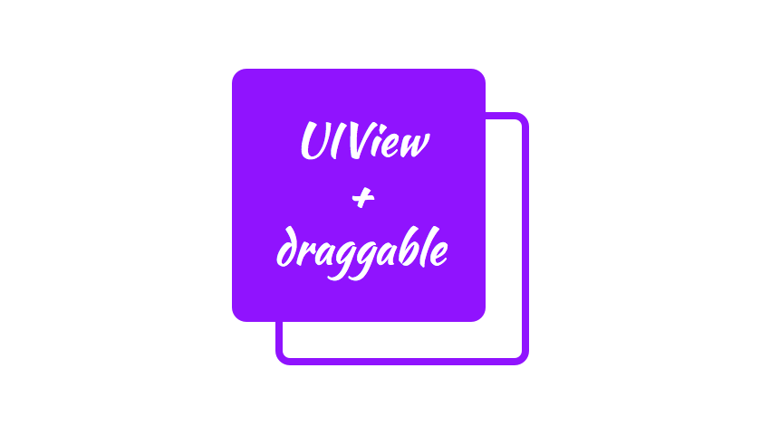

<p align="center">
  
</p>

[](https://travis-ci.org/cevitcejbo/UIView-draggable)
[](https://coveralls.io/r/cevitcejbo/UIView-draggable)
[](http://cocoapods.org/?q=summary%3Auiview%20name%3Adraggable%2A)
[](https://github.com/Carthage/Carthage)

UIView category that adds dragging capabilities.

<p align="center">
  <a href='https://appetize.io/app/rey013220c4b9pex34kg1qaf84' alt='Live demo'>
    
  </a>
</p>

##Screenshot


##Setup with CocoaPods
* Add ```pod 'UIView+draggable'``` to your Podfile
* Run ```pod install```
* Run ```open App.xcworkspace```

##Setup with Carthage
```
github "andreamazz/UIView-draggable"
```

####Objective-C

Import ```UIView+draggable.h``` in your controller's header file

####Swift

If you are using `use_frameworks!` in your Podfile, use this import:
```swift
import UIView_draggable
```

##Usage
Call `enableDragging` on a UIView instance

####Objective-C

```objc
// Enable dragging
[self.view enableDragging];
```

####Swift

```swift
view.enableDragging()
```

##Options
The movement area can be restricted to a given rect:

```swift
view.cagingArea = CGRectMake(0, 0, 200, 200)
```

The movement can be restricted over one coordinate:

```swift
view.shouldMoveAlongX = true
view.shouldMoveAlongY = true
```

The area where the dragging action starts can be configured:

```swift
view.handle = CGRectMake(0, 0, 20, 20)
```

#Author
[Andrea Mazzini](https://twitter.com/theandreamazz). I'm available for freelance work, feel free to contact me. 

Want to support the development of [these free libraries](https://cocoapods.org/owners/734)? Buy me a coffee ☕️ via [Paypal](https://www.paypal.me/andreamazzini).  

#Contributors
Thanks to [everyone](https://github.com/andreamazz/UIView-draggable/graphs/contributors) kind enough to submit a pull request. 

#MIT License
	The MIT License (MIT)

	Copyright (c) 2015 Andrea Mazzini

	Permission is hereby granted, free of charge, to any person obtaining a copy of
	this software and associated documentation files (the "Software"), to deal in
	the Software without restriction, including without limitation the rights to
	use, copy, modify, merge, publish, distribute, sublicense, and/or sell copies of
	the Software, and to permit persons to whom the Software is furnished to do so,
	subject to the following conditions:

	The above copyright notice and this permission notice shall be included in all
	copies or substantial portions of the Software.

	THE SOFTWARE IS PROVIDED "AS IS", WITHOUT WARRANTY OF ANY KIND, EXPRESS OR
	IMPLIED, INCLUDING BUT NOT LIMITED TO THE WARRANTIES OF MERCHANTABILITY, FITNESS
	FOR A PARTICULAR PURPOSE AND NONINFRINGEMENT. IN NO EVENT SHALL THE AUTHORS OR
	COPYRIGHT HOLDERS BE LIABLE FOR ANY CLAIM, DAMAGES OR OTHER LIABILITY, WHETHER
	IN AN ACTION OF CONTRACT, TORT OR OTHERWISE, ARISING FROM, OUT OF OR IN
	CONNECTION WITH THE SOFTWARE OR THE USE OR OTHER DEALINGS IN THE SOFTWARE.
